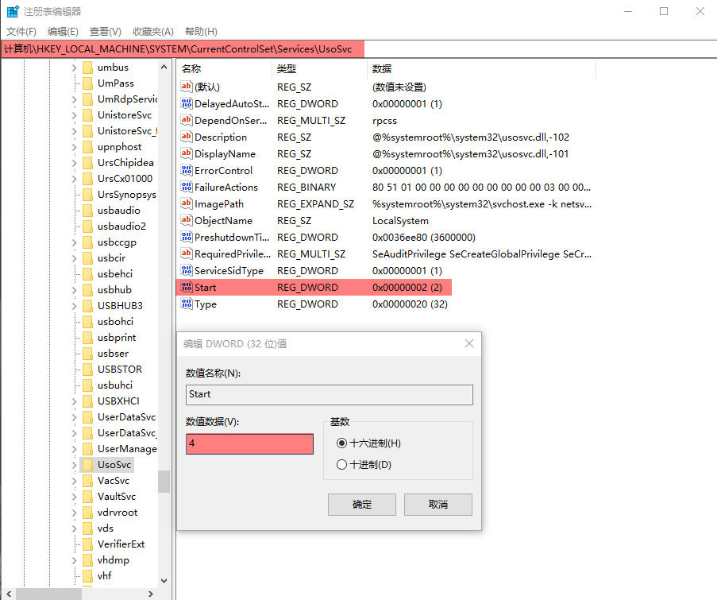
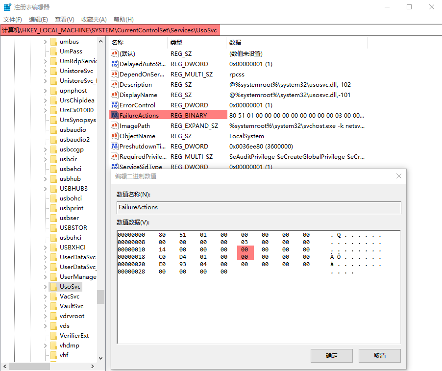
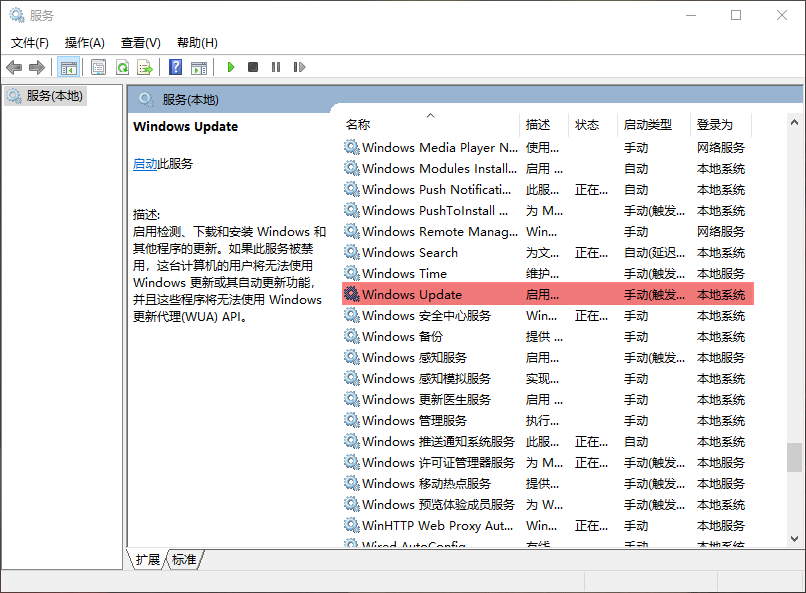
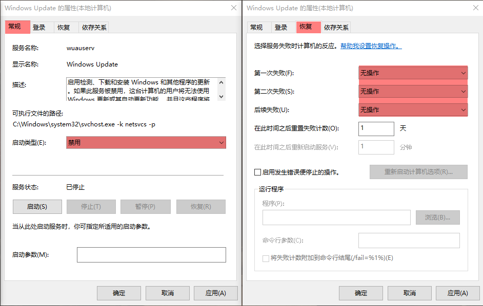
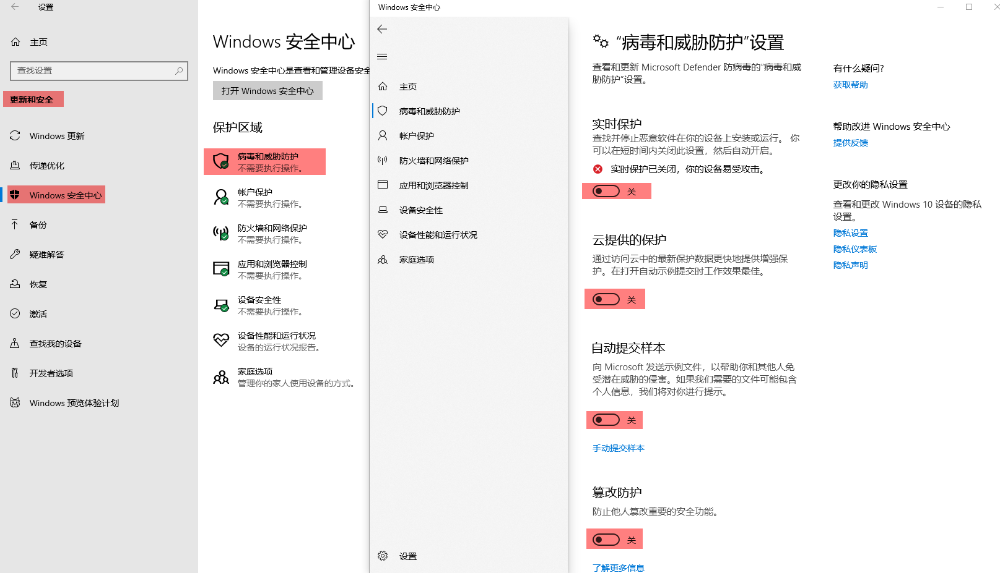
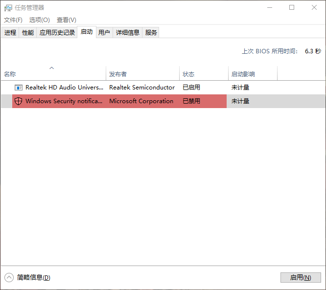
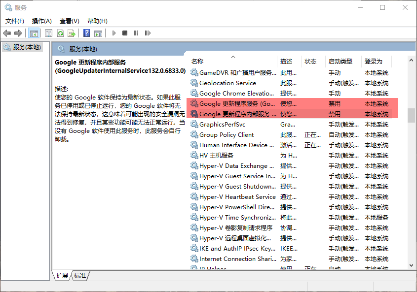

# Windows

## KMSpro

[KMSpro.bat](https://github.com/charlesbases/applications/blob/master/Windows_KMSpro.cmd)


## Microsoft

- [Microsoft Visual C++ 2015-2022](https://learn.microsoft.com/zh-cn/cpp/windows/latest-supported-vc-redist?view=msvc-170#visual-studio-2015-2017-2019-and-2022)
- [vc_redist.x64](https://aka.ms/vs/17/release/vc_redist.x64.exe)


### Windows Update

#### 1. gpedit

```shell
1. Win+S 搜索 组策略
2. 搜索路径: 计算机配置/管理模板/Windows 组件/Windows 更新
```

- 配置自动更新/已禁用
- 删除所有使用Windows更新功能的访问权限/已启用


#### 2. regedit

```shell
1. Win+S 搜索 注册表
2. 搜索路径: 计算机\HKEY_LOCAL_MACHINE\SYSTEM\CurrentControlSet\Services\UsoSvc
```






#### 3. services

```shell
1. Win+S 搜索 服务
```






### Windows Defender

#### 1. gpedit

```shell
1. Win+S 搜索 组策略
2. 搜索路径: 计算机配置/管理模板/Windows 组件/Windows Defender 防病毒
```

- 关闭 Windows Defender 防病毒/已启用
- 允许反恶意软件服务始终保持运行状态/已禁用
- 实时保护/关闭实时保护/已启用
- 实时保护/扫描所有下载文件和附件/已禁用


#### 2. settings




#### 3. task manager

```shell
# 任务管理器禁用 `Windows Security notification icon`
```




## Fonts

### [mononoki](https://raw.githubusercontent.com/charlesbases/applications/refs/heads/master/Fonts/mononoki.zip)


## Git-for-Windows

### [v2.46.2](https://github.com/git-for-windows/git/releases/download/v2.46.2.windows.1/Git-2.46.2-64-bit.exe)


[git_configure.sh](./Scripts/win/git_configure.sh)

```shell
sh -c "$(curl -fsSL https://raw.githubusercontent.com/charlesbases/applications/master/Scripts/win/git_configure.sh)"
```


configuration

```shell
# [CMD] 添加 PATH
SETX PATH "%PATH%;D:\local\git\bin" /M

# 配置目录映射, 模拟 linux 环境
mklink /J "D:\local\git\opt" "D:\opt"
mklink /J "D:\local\git\usr\local" "D:\local"
```

```shell
# /etc/inputrc

# git-bash 删除键闪屏
sed -i -s 's/set bell-style visible/set bell-style none/g' /etc/inputrc

# 历史记录前缀搜索
cat >> /etc/inputrc << EOF
"\e[A": history-search-backward
"\e[B": history-search-forward
EOF
```

```shell
# /etc/vimrc

cat >> /etc/vimrc << EOF
set noeb                     " 去除错误提示音
set number                   " 显示行号
set autoread                 " 自动加载文件改动
set expandtab                " 替换 Tab
set cursorline               " 突出显示当前行
set ignorecase               " 搜索忽略大小写
set noswapfile               " 禁用 swp 文件

set tabstop=2                " Tab键的宽度
set cmdheight=2              " 命令行高度

" set termguicolors            " 开启真彩色
" colorscheme habamax          " habamax pablo slate wildcharm
EOF
```

```shell
# /etc/profile.d

# [可选] 移除 /etc/profile.d/aliases.sh 中 "alias ls='ls -F'" 部分，移除文件夹后面的 "/"
sed -i -s "s/^alias ls='ls -F /alias ls='ls /" /etc/profile.d/aliases.sh

# $USERPROFILE.sh
cat > /etc/profile.d/$USERNAME.sh << EOF
#!/usr/bin/env bash

# 将每个 session 的历史记录行追加到历史文件中
PROMPT_COMMAND='history -a'

# alias
alias l='ls -lhv'
alias la='ls -alhv'
alias open='start "" '

EOF

# git-prompt.sh
curl -L https://raw.githubusercontent.com/charlesbases/applications/master/Git/git-prompt.sh --output /etc/profile.d/git-prompt.sh
```

```shell
# gitconfig

# ~/.gitconfig (全局配置)
curl -L https://raw.githubusercontent.com/charlesbases/applications/master/Git/gitconfig --output "$USERPROFILE\.gitconfig"
```

```shell
# 配置 git.http 代理
git config --global http.proxy "socks5://127.0.0.1:33211"

# 配置 git.ssh 代理
cat >> "$USERPROFILE\.ssh\config" << EOF
Host github.com
  Hostname github.com
  Port 22
  User zhiming.sun
  ProxyCommand connect -S 127.0.0.1:33211 %h %p
EOF
```


### Windows Terminal

- [v1.20.11781.0](https://github.com/microsoft/terminal/releases/download/v1.20.11781.0/Microsoft.WindowsTerminal_1.20.11781.0_x64.zip)

```shell
# settings.json
curl -L https://raw.githubusercontent.com/charlesbases/applications/master/WindowsTerminal/settings.json --output "$USERPROFILE\AppData\Local\Microsoft\Windows Terminal\settings.json"
```


### wget

- [1.21.4](https://eternallybored.org/misc/wget/1.21.4/64/wget.exe)

  ```shell
  # 自动安装
  curl -L https://eternallybored.org/misc/wget/1.21.4/64/wget.exe --output "C:\Windows\wget.exe"
  ```


### tree

- [1.5.2.2](https://jaist.dl.sourceforge.net/project/gnuwin32/tree/1.5.2.2/tree-1.5.2.2-bin.zip?viasf=1)

  ```shell
  # 自动安装
  curl -L https://jaist.dl.sourceforge.net/project/gnuwin32/tree/1.5.2.2/tree-1.5.2.2-bin.zip?viasf=1 --output tree.zip
  unzip tree.zip -d tree
  mv tree/bin/tree.exe 'C:\Windows\'
  rm -rf tree tree.zip
  ```

  

### ssh

```shell
cd && mkdir .ssh && cd .ssh
ssh-keygen -t rsa -b 2048 -C "zhiming.sun" -f id_rsa
```


## Languages

### golang

- [git-for-windows](#git-for-windows)
- [go 1.22](https://dl.google.com/go/go1.22.10.windows-amd64.msi)


[go_install.sh](./Scripts/win/go_install.sh)

```shell
sh -c "$(curl -fsSL https://raw.githubusercontent.com/charlesbases/applications/master/Scripts/win/go_install.sh)"
```


configuration

```shell
# [PowerShell]

# 删除用户级变量
Remove-ItemProperty HKCU:\Environment PATH
Remove-ItemProperty HKCU:\Environment GOPATH
```

```shell
# [CMD]

# 配置 Windows 环境变量
SETX GOHOME "D:\local\go" /M
SETX GOPATH "D:\opt\go" /M
SETX GOPROXY "https://goproxy.io,direct" /M
SETX GOSUMDB "off" /M
SETX GO111MODULE "on" /M
SETX PATH "%PATH%;D:\opt\go\bin" /M
```

```shell
cat > _go.sh << EOF
#!/bin/bash

# 删除用户变量
powershell -Command "Remove-ItemProperty HKCU:\Environment PATH" &>/dev/null
powershell -Command "Remove-ItemProperty HKCU:\Environment GOPATH" &>/dev/null

# 配置 Git for Windows 环境变量
if [[ -n "$(grep -w "^# golang" /etc/profile.d/$USERNAME.sh)" ]]; then exit; fi

echo '''
# golang
export GOHOME="/usr/local/go"
export GOPATH="/opt/go"
export GOSUMDB="off"
export GOPROXY="https://goproxy.io,direct"
export GO111MODULE="on"

alias cs="cd /opt/go/src"
''' >> /etc/profile.d/$USERNAME.sh

EOF

bash ./_go.sh; rm -r _go.sh
```


```shell
# 配置 Git for Windows 环境变量
cat >> /etc/profile.d/$USERNAME.sh << "EOF"
export GOHOME="/usr/local/go"
export GOPATH="/opt/go"
export GOSUMDB="off"
export GOPROXY="https://goproxy.io,direct"
export GO111MODULE="on"
export PATH="$PATH:/opt/go/bin"

alias cs="cd /opt/go/src"
EOF

source /etc/profile.d/$USERNAME.sh
mkdir -p $GOPATH/{bin,pkg,src}
```


### python

- [git-for-windows](#git-for-windows)
- [python 3.12.8](https://www.python.org/ftp/python/3.12.8/python-3.12.8-amd64.exe)


## Applications

### proxy

- [v2aky](https://dl.v2aky.net/clients/v2aky_windows_4.1.8.exe)

  

### snipaste

- [latest](https://dl.snipaste.com/win-x64-cn)


### Typora

- [latest](https://download2.typoraio.cn/windows/typora-setup-x64.exe)

```shell
url="https://download2.typoraio.cn/windows/typora-setup-x64.exe"

cat > install.bat << EOF
@echo off
::echo param[0] = %0
::echo param[1] = %1
start /wait "" %1
EOF

cat > typora.sh << EOF
#!/bin/bash

set -e

# install
curl -s -L "$url" --output "typora.exe"
./install.bat "typora.exe"

# install theme
appdata="$USERPROFILE\AppData\Roaming\Typora\themes"
if [[ ! -d "$appdata" ]]; then mkdir -p "$appdata"; fi
curl -L https://raw.githubusercontent.com/charlesbases/applications/master/Typora/theme/hemera.css --output "$appdata\hemera.css"
curl -L https://raw.githubusercontent.com/charlesbases/applications/master/Typora/theme/nyx.css --output "$appdata\nyx.css"

# clean
rm -r install.bat typora.exe
EOF

bash ./typora.sh; rm -r typora.sh
```


### JetBrains

#### 1. [rider-2024.1](https://download-cdn.jetbrains.com/rider/JetBrains.Rider-2024.1.6.exe)


```shell
version=2024.1.6
version_short=2024.1
install_home="D:\JetBrains\rider"

cat > install.bat << EOF
@echo off
::echo param[0] = %0
::echo param[1] = %1
start /wait "" %1
EOF

cat > jetbrains-rider.sh << EOF
#!/bin/bash

set -e

# download
filename="rider-$version.exe"
curl -L "https://download.jetbrains.com/rider/JetBrains.Rider-$version.exe" --output $filename
./install.bat "$filename"

# configure
appdata="$USERPROFILE\AppData\Roaming\JetBrains\Rider$version_short"
if [ -d "$appdata" ]; then rm -rf $appdata; fi
mkdir -p $appdata &>/dev/null

# roaming
curl -L https://raw.githubusercontent.com/charlesbases/applications/master/JetBrains/rider/win/$version_short/roaming.zip --output roaming.zip
unzip -o -q roaming.zip -d $appdata

# settings
curl -L https://raw.githubusercontent.com/charlesbases/applications/master/JetBrains/rider/win/$version_short/setting.zip --output setting.zip
unzip -o -q setting.zip -d $appdata

# rm llmInstaller
if [[ -d "$install_home\plugins\llmInstaller" ]]； then rm -rf "$install_home\plugins\llmInstaller"; fi

# clean
rm -r install.bat roaming.zip setting.zip $filename
EOF

bash ./jetbrains-rider.sh; rm -r jetbrains-rider.sh
```


#### 2. [goland-2024.1](https://download-cdn.jetbrains.com/go/goland-2024.1.6.exe)

- [golang](#golang)


```shell
version=2024.1.6
version_short=2024.1
install_home="D:\JetBrains\goland"

cat > install.bat << EOF
@echo off
::echo param[0] = %0
::echo param[1] = %1
start /wait "" %1
EOF

cat > jetbrains-goland.sh << EOF
#!/bin/bash

set -e

# download
curl -L "https://download.jetbrains.com/go/goland-$version.exe" --output goland-$version.exe
./install.bat "goland-$version.exe"

# configure
appdata="$USERPROFILE\AppData\Roaming\JetBrains\GoLand$version_short"
if [ -d "$appdata" ]; then rm -rf $appdata; fi
mkdir -p $appdata &>/dev/null

# roaming
curl -L https://raw.githubusercontent.com/charlesbases/applications/master/JetBrains/goland/win/$version_short/roaming.zip --output roaming.zip
unzip -o -q roaming.zip -d $appdata

# settings
curl -L https://raw.githubusercontent.com/charlesbases/applications/master/JetBrains/goland/win/$version_short/setting.zip --output setting.zip
unzip -o -q setting.zip -d $appdata

# rm llmInstaller
if [[ -d "$install_home\plugins\llmInstaller" ]]； then rm -rf "$install_home\plugins\llmInstaller"; fi

# clean
rm -r install.bat roaming.zip setting.zip goland-$version.exe
EOF

bash ./jetbrains-goland.sh; rm -r jetbrains-goland.sh
```


#### 3. [pycharm-2024.1](https://download-cdn.jetbrains.com/python/pycharm-professional-2024.1.7.exe)

- [python](#python)


```shell
version=2024.1.7
version_short=2024.1
install_home="D:\JetBrains\pycharm"

cat > install.bat << EOF
@echo off
::echo param[0] = %0
::echo param[1] = %1
start /wait "" %1
EOF

cat > jetbrains-pycharm.sh << EOF
#!/bin/bash

set -e

# download
filename="pycharm-$version.exe"
curl -L "https://download.jetbrains.com/python/pycharm-professional-$version.exe" --output $filename
./install.bat "$filename"

# configure
appdata="$USERPROFILE\AppData\Roaming\JetBrains\Rider$version_short"
if [ -d "$appdata" ]; then rm -rf $appdata; fi
mkdir -p $appdata &>/dev/null

# roaming
curl -L https://raw.githubusercontent.com/charlesbases/applications/master/JetBrains/pycharm/win/$version_short/roaming.zip --output roaming.zip
unzip -o -q roaming.zip -d $appdata

# settings
curl -L https://raw.githubusercontent.com/charlesbases/applications/master/JetBrains/pycharm/win/$version_short/setting.zip --output setting.zip
unzip -o -q setting.zip -d $appdata

# rm llmInstaller
if [[ -d "$install_home\plugins\llmInstaller" ]]； then rm -rf "$install_home\plugins\llmInstaller"; fi

# clean
rm -r install.bat roaming.zip setting.zip $filename
EOF

bash ./jetbrains-pycharm.sh && rm -r jetbrains-pycharm.sh
```


#### 4. [datagrip-2024.1](https://download-cdn.jetbrains.com/datagrip/datagrip-2024.1.5.exe)

```shell
version=2024.1.5
version_short=2024.1
install_home="D:\JetBrains\datagrip"

cat > install.bat << EOF
@echo off
::echo param[0] = %0
::echo param[1] = %1
start /wait "" %1
EOF

cat > jetbrains-datagrip.sh << EOF
#!/bin/bash

set -e

# download
filename="pycharm-$version.exe"
curl -L "https://download.jetbrains.com/datagrip/datagrip-$version.exe" --output $filename
./install.bat "$filename"

# configure
appdata="$USERPROFILE\AppData\Roaming\JetBrains\DataGrip$version_short"
if [ -d "$appdata" ]; then rm -rf $appdata; fi
mkdir -p $appdata &>/dev/null

# roaming
curl -L https://raw.githubusercontent.com/charlesbases/applications/master/JetBrains/datagrip/win/$version_short/roaming.zip --output roaming.zip
unzip -o -q roaming.zip -d $appdata

# settings
curl -L https://raw.githubusercontent.com/charlesbases/applications/master/JetBrains/datagrip/win/$version_short/setting.zip --output setting.zip
unzip -o -q setting.zip -d $appdata

# rm llmInstaller
if [[ -d "$install_home\plugins\llmInstaller" ]]； then rm -rf "$install_home\plugins\llmInstaller"; fi

# clean
rm -r install.bat roaming.zip setting.zip $filename
EOF

bash ./jetbrains-datagrip.sh; rm -r jetbrains-datagrip.sh
```


### Google Chrome

- [versions](https://google-chrome.en.uptodown.com)
- [129.0.6668.101](https://github.com/charlesbases/lfs/raw/refs/heads/master/google_chrome/win/129.0.6668.101.msi?download=)

```shell
# [CMD] Google 文件夹软链
md "D:\Google"
mklink /J "C:\Program Files\Google" "D:\Google"
```

- Options

  ```shell
  # --incognito                 隐身模式启动
  # --ignore-certificate-errors 忽略证书错误
  ```

- Regedit

  ```powershell
  # 隐身模式打开链接
  Set-ItemProperty -Path "HKLM:\SOFTWARE\Classes\ChromeHTML\shell\open\command" -Name "(default)" -Value '"C:\Program Files\Google\Chrome\Application\chrome.exe" --incognito --single-argument %1'
  ```

  

- Google Update

  ```shell
  # Win+X 搜索 服务
  
  # Google 更新程序服务(禁用)
  # Google 更新程序内部服务(禁用)
  ```

  


### Sublime Text

- [3211](https://download.sublimetext.com/Sublime%20Text%20Build%203211%20x64%20Setup.exe)

  ```shell
  # 修改 hosts
  cat >> "C:\Windows\System32\drivers\etc\hosts" << EOF
  
  127.0.0.1 www.sublimetext.com
  127.0.0.1 license.sublimehq.com
  EOF
  
  # license
  curl -L https://raw.githubusercontent.com/charlesbases/applications/master/SublimeText/3211.txt
  ```

  

- [4180](https://download.sublimetext.com/sublime_text_build_4180_x64_setup.exe)

  ```shell
  # 1. 拷贝副本 `sublime_text_copy.exe` 并打开副本
  # 2. 打开原文件 `sublime_text.exe`
  # 3. 搜索 `8079 0500 0f94 c2` 并替换为 `c641 0501 b200 90`
  ```

```shell
# Packages

curl -L https://raw.githubusercontent.com/charlesbases/applications/master/SublimeText/User/One%20Dark%20Pro.tmTheme --output "$USERPROFILE\AppData\Roaming\Sublime Text\Packages\User\One Dark Pro.tmTheme"

curl -L https://raw.githubusercontent.com/charlesbases/applications/master/SublimeText/User/Preferences.sublime-settings --output "$USERPROFILE\AppData\Roaming\Sublime Text\Packages\User\Preferences.sublime-settings"
```


### Dockers Desktop

- [v4.34.3](https://desktop.docker.com/win/main/amd64/170107/Docker%20Desktop%20Installer.exe)

  ```shell
  $ docker version
  Client:
   Version:           27.2.0
   API version:       1.47
   Go version:        go1.21.13
   Git commit:        3ab4256
   Built:             Tue Aug 27 14:17:17 2024
   OS/Arch:           windows/amd64
   Context:           default
  ```

  

```shell
# [CMD] Docker 文件夹软链
md "D:\Docker"
mklink /J "C:\Program Files\Google" "D:\Docker"
```
